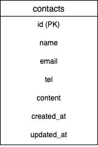

# laravel-docker-templat

# お問合せフォーム（アプリ名）

## 概要
練習用のお問合せフォームです

## 環境構築手順

リポジトリをClone

git clone git@github.com:ogatatouya/contact-form3.git

Dockerを起動

docker compose up -d --build

envファイルの準備

cp src/.env.example src/.env

envファイルの書き換えが必要

DB_USERNAME=laravel_user

DB_PASSWORD=laravel_pass

Laravelのセットアップ

docker-compose exec php bash

composer install

php artisan key:generate
php artisan migrate

## 使用技術(実行環境)
- PHP 8.1
- Laravel 8.83.8
- MySQL 8.0

## ER図

## 動作URL
- 開発環境：http://localhost/
- phpMyAdmin:：http://localhost:8080/

`` `